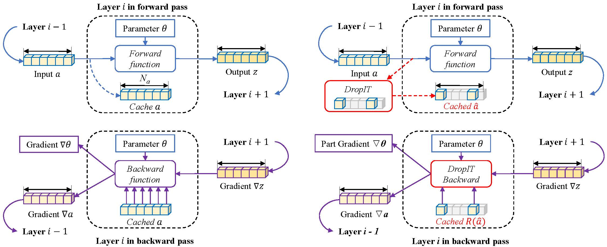

# DropIT: Dropping Intermediate Tensors for Memory-Efficient DNN Training

Code and models of ICLR 2023 submission: DropIT: Dropping Intermediate Tensors for Memory-Efficient DNN Training (https://openreview.net/forum?id=Kn6i2BZW69w)



## Installation

```python
# install pytorch & timm
conda install pytorch torchvision cudatoolkit=11.6 -c pytorch -c conda-forge
pip install timm

# build dropit
pip install -e .
```

## Easy Usage

```python
# define your model 
from timm.models import create_model
model = create_model('deit_tiny_patch16_224')

# use dropit, mink gamma=90%
from dropit import to_dropit
to_dropit(model, strategy='mink', gamma=0.9)
```

## Training with DropIT!

Tuning number of GPUs by ```--nproc_per_node``` and batch size per GPU by ```--batch-size```, to fit your GPUs.

### DeiT [benchmarks/deit](benchmarks/deit)

**DeiT-Ti training from scratch on ImageNet-1k**

Choose a gamma to train, e.g. gamma=0.7:

```shell
torchrun --rdzv_backend=c10d --rdzv_endpoint=localhost:0 --nnodes=1 --nproc_per_node=2 main.py --model deit_tiny_patch16_224 --data-set IMNET --data-path /your/imagenet/data/path --dropit --strategy mink --gamma 0.7
```

**DeiT-S and DeiT-B fine-tuning on CIFAR-100**

Download DeiT-S and DeiT-B public ImageNet-1k weights:
```
wget https://dl.fbaipublicfiles.com/deit/deit_small_patch16_224-cd65a155.pth
wget https://dl.fbaipublicfiles.com/deit/deit_base_patch16_224-b5f2ef4d.pth
```

Choose a gamma to train, e.g. gamma=0.9:

```shell
torchrun --rdzv_backend=c10d --rdzv_endpoint=localhost:0 --nnodes=1 --nproc_per_node=2 main.py --model deit_small_patch16_224 --finetune deit_small_patch16_224-cd65a155.pth --data-set CIFAR --data-path /your/cifar/data/path  --batch-size 384  --opt sgd --lr 0.01 --unscale-lr --weight-decay 0.0001 --epochs 1000 --dropit --strategy mink --gamma 0.9
```

```shell
torchrun --rdzv_backend=c10d --rdzv_endpoint=localhost:0 --nnodes=1 --nproc_per_node=2 main.py --model deit_base_patch16_224 --finetune deit_base_patch16_224-b5f2ef4d.pth --data-set CIFAR --data-path /your/cifar/data/path  --batch-size 384  --opt sgd --lr 0.01 --unscale-lr --weight-decay 0.0001 --epochs 1000 --dropit --strategy mink --gamma 0.9
```

### Faster/Mask R-CNN [benchmarks/rcnn](benchmarks/rcnn)

**Faster R-CNN training on COCO**

Choose a gamma to train, e.g. gamma=0.9:

```shell
torchrun --nproc_per_node=8 train.py --dataset coco --model fasterrcnn_resnet50_fpn --batch-size 2 --epochs 26 --lr-steps 16 22 --aspect-ratio-group-factor 3 --weights-backbone ResNet50_Weights.IMAGENET1K_V1 --dropit --strategy mink --gamma 0.9
```

**Mask R-CNN training on COCO**

Choose a gamma to train, e.g. gamma=0.8:

```shell
torchrun --nproc_per_node=8 train.py --dataset coco --model maskrcnn_resnet50_fpn --batch-size 2 --epochs 26 --lr-steps 16 22 --aspect-ratio-group-factor 3 --weights-backbone ResNet50_Weights.IMAGENET1K_V1 --dropit --strategy mink --gamma 0.8
```

## Combination with GACT/MESA

Comming soon.

## Implementation

DeiT and R-CNN are borrowed codes from https://github.com/facebookresearch/deit and https://github.com/pytorch/vision/tree/main/references/detection, respectively. A huge thanks go to them. 
